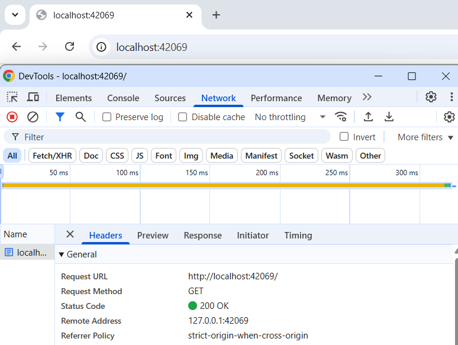

# HTTP-C: A Simple HTTP Server in C

HTTP-C is a lightweight, modular HTTP/1.1 server implemented in C. It's designed to demonstrate fundamental concepts of socket programming, HTTP request parsing, response generation, and basic server architecture in a Unix-like environment.

## Table of Contents

- [Features](#features)
- [Project Structure](#project-structure)
- [Core Components](#core-components)
- [Prerequisites](#prerequisites)
- [Building the Server](#building-the-server)
- [Running the Server](#running-the-server)
- [Usage Examples (curl)](#usage-examples-curl)
- [Browser Output Examples](#browser-output-examples)
- [Makefile Details](#makefile-details)
- [License](#license)

## Features

*   **HTTP/1.1 GET Request Handling:** Primarily processes `GET` requests.
*   **Response Codes Supported:**
    *   **`200 OK`**: For successful requests to the root path (`/`) and the dynamic echo endpoint (`/echo/<message>`).
    *   **`400 Bad Request`**: Sent if the incoming HTTP request is malformed or cannot be parsed.
    *   **`404 Not Found`**: Returned for `GET` requests to routes not explicitly handled by the server (i.e., anything other than `/` or `/echo/`).
    *   **`405 Method Not Allowed`**: Sent for any HTTP method other than `GET`. Includes an `Allow: GET` header.
    *   **`500 Internal Server Error`**: Generated if a server-side error occurs, such as memory allocation failure during response construction.
*   **Echo Endpoint (`/echo/<message>`):** Dynamically generates a `200 OK` response, echoing back the `<message>` provided in the path. This demonstrates basic dynamic content generation.
*   **Graceful Shutdown:** Implements a `SIGINT` (Ctrl+C) signal handler for clean server termination, ensuring resources are properly released.
*   **Structured Request Parsing:** Parses incoming HTTP request lines into a structured format (method, route, HTTP version, and arguments).
*   **Modular Design:** Code is organized into logical modules (headers and source files) for improved readability, maintainability, and separation of concerns.
*   **Out-of-Source Builds:** Compiled object files and the final executable are placed in a separate `build/` directory, keeping the source tree clean.

## Project Structure

The project is organized into distinct directories for source code, include files, and build artifacts:

```
http-c/
├── src/                    # Contains all C source (.c) files
│   ├── main.c
│   ├── http_types.c
│   ├── http_parser.c
│   ├── http_response.c
│   ├── server.c
│   └── signal_handler.c
├── include/                # Contains all custom header (.h) files
│   ├── config.h
│   ├── http_types.h
│   ├── http_parser.h
│   ├── http_response.h
│   ├── server.h
│   └── signal_handler.h
├── build/                  # Generated directory for compiled object files and the final executable
├── Makefile                # Build instructions for the project
├── assets/                 # (Optional) For images and other assets
│   └── browser_root_output.png
│   └── browser_echo_output.png
└── README.md               # This file: Project documentation
```

## Core Components

- **`src/main.c`**: The main application entry point. Orchestrates the server setup, main event loop (accepting connections), and initiates graceful shutdown.
- **`include/config.h`**: Defines global configuration constants (e.g., `PORT`, `BUFFER_SIZE`).
- **`http_types.c` / `include/http_types.h`**: Defines `ClientRequest` and `ServerResponse` structures for representing HTTP data, along with helper functions to free their allocated memory.
- **`http_parser.c` / `include/http_parser.h`**: Encapsulates the logic for parsing raw HTTP client request lines into the `ClientRequest` structure.
- **`http_response.c` / `include/http_response.h`**: Handles initialization of standard server responses (e.g., 200 OK, 404 Not Found) and constructs dynamic responses, such as for the `/echo/` endpoint.
- **`server.c` / `include/server.h`**: Contains the core networking logic:
  - `setup_server_socket()`: Initializes and binds the listening socket.
  - `handle_accept()` (if implemented as per last suggestion, otherwise `accept()` is in `main.c`): Manages accepting new client connections.
  - `handle_client()`: Processes an individual client's request after connection.
- **`signal_handler.c` / `include/signal_handler.h`**: Manages POSIX signal handling (specifically `SIGINT` for graceful shutdown) and the global `keep_running` flag.

## Prerequisites

To build and run this server, you will need:

- A C compiler supporting C11 (e.g., `gcc`).
- The `make` utility.
- A POSIX-compliant environment (Linux, macOS, or a Unix-like environment on Windows).
  - **For Windows users:** It is **highly recommended** to use [Windows Subsystem for Linux (WSL)](https://docs.microsoft.com/en-us/windows/wsl/install) or a similar environment like [MSYS2](https://www.msys2.org/) with a MinGW-w64 toolchain. The server uses POSIX-specific networking APIs and headers (e.g., `<netinet/in.h>`, `<sys/socket.h>`, `<unistd.h>`) not natively available in standard Windows development environments.

## Building the Server

1.  Clone or download the project files.
2.  Navigate to the root project directory (`http-c/`) containing the `Makefile`.
3.  Run `make`:

    ```bash
    make
    ```

    This command will:

    - Create a `build/` directory if it doesn't exist.
    - Compile all source files from the `src/` directory into object files (`.o`) within the `build/` directory.
    - Link these object files to create the final executable `http_server`, also placed in the `build/` directory.

4.  For a debug build (with debugging symbols and a `DEBUG` macro defined):

    ```bash
    make debug
    ```

## Running the Server

After a successful build, the executable will be located in the `build/` directory.

1.  From the root project directory (`http-c/`), run:

    ```bash
    ./build/http_server
    ```

    Alternatively, you can use the `make run` target:

    ```bash
    make run
    ```

    This will build the server (if necessary) and then execute it.

2.  The server will start listening on port `42069` (as defined in `include/config.h`). You will see log messages in your terminal:

    ```
    Logs from the program will appear here.
    Waiting for a client to connect on port 42069...
    Press Ctrl+C to stop the server.
    ```

3.  To stop the server, press `Ctrl+C` in the terminal where it's running. This will trigger the `SIGINT` signal handler for a graceful shutdown.

## Usage Examples (curl)

You can interact with the server using a web browser or a command-line tool like `curl`.

1.  **Accessing the Root Path (`/`):**

    ```bash
    curl -v http://localhost:42069/
    ```

    _Server Log:_ `200 OK Response Sent (root).`
    _`curl` Output:_ `HTTP/1.1 200 OK`

2.  **Using the Echo Endpoint (`/echo/<message>`):**

    ```bash
    curl -v http://localhost:42069/echo/hello_from_C
    ```

    _Server Log:_ `Echo Response Sent.`
    _`curl` Output (including headers):_

    ```http
    HTTP/1.1 200 OK
    Content-Type: text/plain
    Content-Length: 14

    hello_from_C
    ```

3.  **Accessing a Non-Existent Path:**

    ```bash
    curl -v http://localhost:42069/thisdoesnotexist
    ```

    _Server Log:_ `404 Not Found Response Sent.`
    _`curl` Output:_ `HTTP/1.1 404 Not Found`

4.  **Using an Unsupported HTTP Method (e.g., POST):**
    ```bash
    curl -vX POST http://localhost:42069/
    ```
    _Server Log:_ `405 Method Not Allowed sent.`
    _`curl` Output (including headers):_
    ```http
    HTTP/1.1 405 Method Not Allowed
    Allow: GET
    ```

## Browser Output Examples

Here's how the server responses might look in a web browser.
*(Note: Browsers may render plain text differently. These screenshots are illustrative.)*

1.  **Root Path (`http://localhost:42069/`):**
    The browser will typically display the raw status line if no HTML content is provided.
    ```
    HTTP/1.1 200 OK
    ```
    
    *Image of the output "HTTP/1.1 200 OK" for the root path*

2.  **Echo Endpoint (`http://localhost:42069/echo/HTTP-C_Says_Hello_!!!`):**
    The browser will display the echoed text.
    ```
    HTTP-C_Says_Hello_!!!
    ```
    
    *An Image of the output body with text "HTTP-C_Says_Hello_!!!".*

## Makefile Details

The `Makefile` automates the build process and is configured for the project's structure:

- **`CFLAGS`**: Includes essential compiler flags:
  - `-Wall -Wextra -pedantic -std=c17`: For strict warnings and C17 standard compliance.
  - `-D_POSIX_C_SOURCE=200809L`: To enable POSIX.1-2008 features.
  - `-Iinclude`: Instructs the compiler to search for header files in the `include/` directory.
- **`SRC_DIR`, `INC_DIR`, `BUILD_DIR`**: Variables defining the source, include, and build directories.
- **`SRC = $(wildcard $(SRC_DIR)/*.c)`**: Automatically finds all `.c` files in the `src/` directory.
- **`OBJ = $(patsubst $(SRC_DIR)/%.c,$(BUILD_DIR)/%.o,$(SRC))`**: Generates object file paths, placing them in the `build/` directory (e.g., `src/main.c` compiles to `build/main.o`).
- **Targets**:
  - `all`: Default target; builds the `http_server` executable in `build/`.
  - `$(BUILD_DIR)/$(TARGET)`: Rule for linking object files into the final executable.
  - `$(BUILD_DIR)/%.o: $(SRC_DIR)/%.c`: Pattern rule for compiling `.c` files from `src/` into `.o` files in `build/`. Ensures the `build/` directory exists.
  - `clean`: Removes the entire `build/` directory, cleaning all compiled artifacts.
  - `debug`: Builds the project with debugging flags (`-g -DDEBUG`).
  - `run`: Builds (if necessary) and runs the server.

## License

This project is open source and available under the MIT License. You are free to use, modify, and distribute it.
